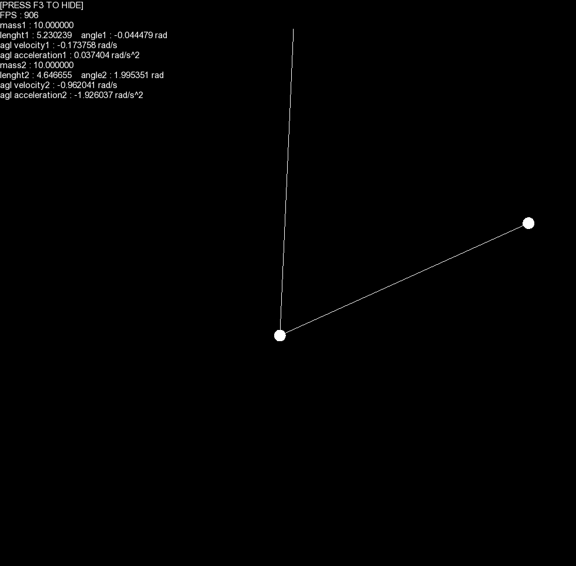
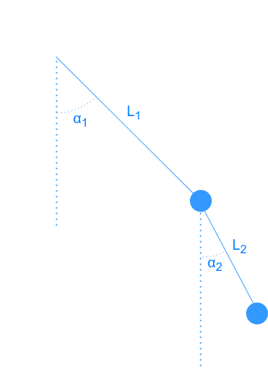

# double-pendulum
A double pendulum simulator.

The window opens at 1000x1000 pixels, but can be resized.  
## Controls
- Press `spacebar` to pause or resume the simulation.  
- Click anywhere in the window to move the nearest mass.  
- The value of the selected mass can be changed by using the `scroll wheel`.  
- Press `left control` and click anywhere to move the point of fixation.  
- The information menu can be hidden by pressing `F3`.  

## Build
This program requires SFML and must be compiled using the options `-lsfml-graphics -lsfml-window -lsfml-system`

## Convetions
Diagram of the conventions used by the notations in the source code:  

